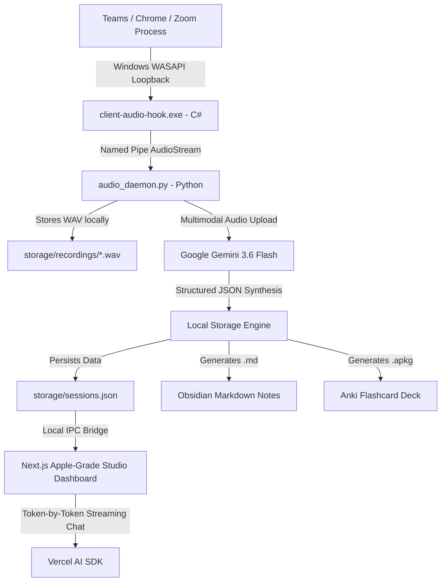

<div align="center">

# ⚡ Nexus — Local-First AI Lecture & Meeting Studio

**Turn chaotic online lectures, college courses, and meetings into structured study materials, Anki decks, and Obsidian notes — 100% locally with zero cloud subscription fees.**

[](https://nextjs.org/)
[](https://reactjs.org/)
[](https://tailwindcss.com/)
[](https://dotnet.microsoft.com/)
[](https://python.org/)
[](https://ai.google.dev/)
[](https://obsidian.md/)
[](https://apps.ankiweb.net/)

---

[Key Features](#-key-features) • [Architecture](#-architecture--data-flow) • [Quick Start](#-quick-start-3-minutes) • [Tech Stack](#-tech-stack) • [Export Ecosystem](#-export-ecosystem)

---

</div>

## 📖 Overview

**Nexus** is an all-in-one desktop studio designed for students, researchers, and professionals. It hooks directly into Windows Core Audio (WASAPI) to capture clean audio from individual software processes (such as **Microsoft Teams, Google Chrome, Discord, or Zoom**) without picking up background microphone noise, system beeps, or requiring virtual audio cables.

Captured audio is synthesized into:
- 📑 **Comprehensive Executive Summaries** & Action Items
- 🗺️ **Multi-Module Structured Course Outlines**
- 📖 **Glossaries of Technical Terminology**
- 🗂️ **Spaced Repetition Flashcards** (with 1-click **Anki `.apkg`** download)
- 📝 **Obsidian & Notion-ready Markdown** (`.md`)
- 🎓 **Interactive Mastery Quizzes** with revealable solutions
- 💬 **Zero-Latency Streaming AI Study Assistant** grounded in the transcript

All notes and transcripts are stored **100% locally on your computer** for complete privacy.

---

## ✨ Key Features

| Feature | Description |
| :--- | :--- |
| **🎙️ In-Browser Audio Studio** | No floating command prompts. The recording controller lives right inside the web dashboard with recognized app icons (Chrome, Teams, Discord, Zoom, Spotify). |
| **📊 Live VU Waveform Meter** | Real-time 6-bar audio frequency visualizer animates with live sound amplitude so you always know audio is actively capturing. |
| **🔒 100% Local-First Storage** | All transcripts, summaries, and audio are saved on your local hard drive. Zero cloud database fees, full privacy, and fast offline operation. |
| **🪡 Multi-Lecture Stitching** | Select multiple lecture parts (e.g. *Part 1* & *Part 2*) and stitch them into a unified **Master Study Guide** with merged outlines and flashcard decks. |
| **✏️ Inline Title Renaming** | Rename any recorded session with a double-click or pencil icon to match your course code (e.g. `CS50 - Memory Allocation`). |
| **⚡ Instant Streaming Assistant** | Ask questions about the lecture and watch answers stream token-by-token (~150ms response) powered by Gemini 3.6 Flash. |
| **🃏 Interactive 3D Flashcards** | Practice active recall with smooth 3D flip animations, mastery tracking, and Anki `.apkg` export. |
| **🍎 Apple-Grade Aesthetic** | Designed with frosted glass surfaces, concentric border radii, subtle specular hairline borders, and responsive tactile animations. |

---

## 🏗 Architecture & Data Flow



---

## 🚀 Quick Start (3 Minutes)

### 1. Prerequisites
Ensure you have the following installed:
- [Node.js 18+](https://nodejs.org/)
- [Python 3.11+](https://python.org/)
- [.NET 8.0 SDK](https://dotnet.microsoft.com/download/dotnet/8.0)
- A free **Google Gemini API Key** from [Google AI Studio](https://aistudio.google.com/)

### 2. Clone the Repository
```bash
git clone https://github.com/your-username/nexus-lecture-studio.git
cd nexus-lecture-studio
```

### 3. Setup Environment Variables
Copy the example environment files and insert your Gemini API Key:

```powershell
# For Web Dashboard
copy web-dashboard\.env.example web-dashboard\.env.local

# For Python Engine
copy local-transcriber-ai\.env.example local-transcriber-ai\.env
```
Inside `.env.local` and `.env`, paste your key:
```env
GOOGLE_GENERATIVE_AI_API_KEY=AIzaSy...
```

### 4. Install Dependencies
```powershell
# Python Dependencies
cd local-transcriber-ai
python -m venv venv
venv\Scripts\pip.exe install -r requirements.txt

# Web Dashboard Dependencies
cd ..\web-dashboard
npm install
```

### 5. Launch Nexus Studio (One-Click)
Simply run the root launcher script:
```powershell
.\Start-Nexus.bat
```
This automatically starts the audio loopback bridge, spins up the Next.js studio, and launches `http://localhost:3000` in your default browser!

---

## 📦 Tech Stack

- **Frontend & Dashboard**: Next.js 16 (Turbopack, App Router), React 19, Tailwind CSS v4, Framer Motion, Lucide Icons.
- **Audio Capture Engine**: C# .NET 8.0 with CSCore (Low-latency WASAPI Process Loopback).
- **Backend & IPC Bridge**: Python 3.11 with PyCaw, Named Pipes, GenAnki, and Google GenAI SDK.
- **AI Intelligence**: Google Gemini 3.6 Flash via Vercel AI SDK (`streamText`) for instant token streaming.
- **Storage Engine**: 100% Local Filesystem (`JSON` / `.md` / `.apkg` / `.wav`).

---

## 📂 Project Structure

```text
transcribe-edtech/
├── Start-Nexus.bat             # 1-Click launcher script
├── storage/                    # Local storage (records, markdown, anki)
│   ├── sessions.json           # Session metadata index
│   ├── recordings/             # Captured .wav audio files
│   ├── markdown/               # Obsidian-formatted lecture notes
│   └── exports/                # Generated Anki .apkg packages
├── client-audio-hook/          # C# WASAPI process capture engine
│   ├── Program.cs              # Process loopback & named pipe server
│   └── client-audio-hook.csproj
├── local-transcriber-ai/       # Python background daemon & AI synthesis
│   ├── audio_daemon.py         # HTTP control daemon for Web Studio
│   ├── ai_synthesis.py         # Gemini 3.6 Flash synthesis engine
│   └── transcriber.py          # Pipe listener & audio normalization
└── web-dashboard/              # Next.js Apple-Grade Studio Web App
    ├── src/app/
    │   ├── page.tsx            # Unified Studio & Dashboard UI
    │   └── api/
    │       ├── audio/route.ts  # Audio bridge to daemon
    │       ├── sessions/       # Local storage CRUD & Stitching
    │       └── chat/route.ts   # Token-streaming Gemini study assistant
    └── src/lib/storage.ts      # Local file storage manager
```

---

## 🎓 Export Ecosystem

### Obsidian Integration
Every recorded session automatically creates an Obsidian-ready `.md` file with frontmatter, callouts, and structured sections. Open your `storage/markdown/` folder directly as an Obsidian vault.

### Anki Integration
Click the **"Anki"** download button on any session to download a pre-formatted `.apkg` deck ready for immediate spaced-repetition study on Desktop, Web, or Mobile.

---

## 📄 License
Distributed under the MIT License. Built with ❤️ for students and continuous learners.
