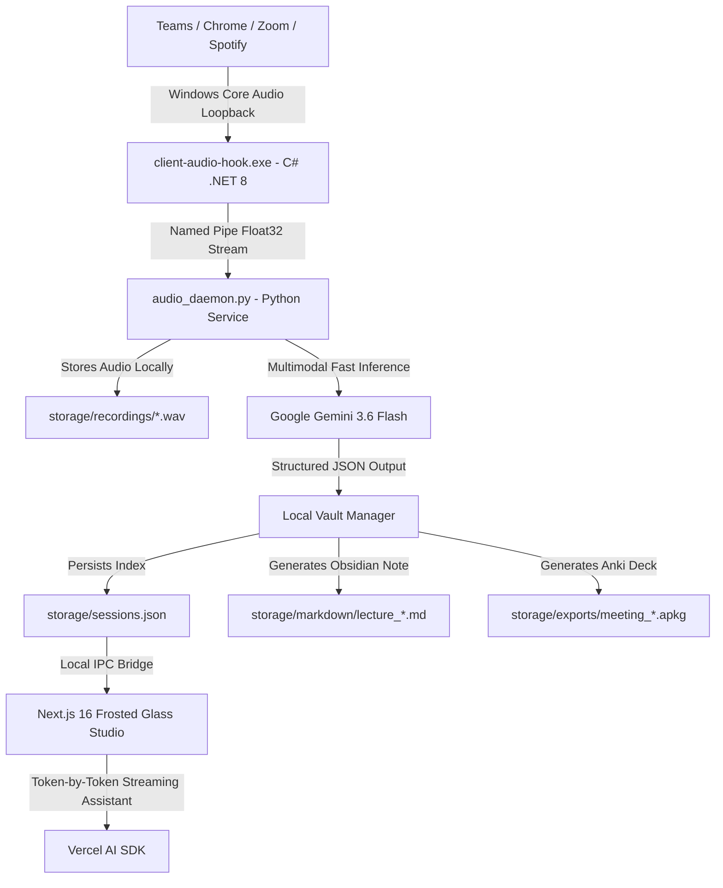

<div align="center">

# ⚡ Nexus — Local-First AI Lecture & Meeting Studio

### The open-source, 100% private alternative to Otter.ai & Granola. Turn live Zoom, Teams, and Chrome audio into structured study guides, Anki decks, and Obsidian notes — entirely offline on your PC with zero subscription fees.

<br/>

[](https://github.com/editorrylix/nexus-ai-lecture-studio/stargazers)
[](https://github.com/editorrylix/nexus-ai-lecture-studio/network/members)
[](https://opensource.org/licenses/MIT)
[](https://nextjs.org/)
[](https://ai.google.dev/)
[](https://obsidian.md/)
[](https://apps.ankiweb.net/)

<br/>

> ⭐ **If you like this project, please consider giving it a star on GitHub! It helps more students, researchers, and developers discover free, private lecture tools.**

<br/>

[Quick Start (3 Mins)](#-quick-start-3-minutes) • [Why Nexus?](#-why-nexus-vs-alternatives) • [Key Features](#-key-features) • [Architecture](#-architecture--data-flow) • [Tech Stack](#-tech-stack) • [Obsidian & Anki](#-export-ecosystem)

---

</div>

## 💡 Why Nexus? (Vs Alternatives)

Traditional AI meeting notetakers like Otter.ai, Fireflies.ai, or Granola come with serious drawbacks: expensive monthly subscriptions, privacy risks, creepy bot avatars joining your call, and cloud lock-in.

**Nexus fixes this by capturing audio directly from Windows internal audio channels (WASAPI Loopback):**

| Feature | Otter.ai / Fireflies | Granola | ⚡ **Nexus Studio (Open Source)** |
| :--- | :---: | :---: | :---: |
| **Pricing** | $16.99–$30 / month | $10 / month | **100% Free Forever (MIT)** |
| **Data Privacy** | Cloud Servers (Stored Remotely) | Cloud Backend | **100% Local Hard Drive (Zero Tracking)** |
| **Call Bot Intrusion** | Bot joins call & interrupts | Needs mic permission | **Silent Process Loopback (No bot needed)** |
| **Process Audio Isolation** | ❌ Captures all room noise | ❌ Captures mic | **✅ Isolates specific app (Teams/Chrome/Zoom)** |
| **Anki Deck Export** | ❌ None | ❌ None | **✅ 1-Click `.apkg` Spaced Repetition Decks** |
| **Obsidian Vault Notes** | ❌ None | Manual export | **✅ Direct `.md` with Callouts & Outlines** |
| **Multi-Lecture Stitching**| ❌ No | ❌ No | **✅ Merge Part 1 & Part 2 into Master Guide** |
| **Built-in Audio Player** | Web Only | Limited | **✅ Scrubber + 1.25x/1.5x/2.0x Speed Control** |

---

## ✨ Key Features

- **🎙️ Process-Specific Audio Hook**: Captures pure digital audio directly from the sound card using Windows WASAPI. Zero microphone background noise, room echoes, or fan hum.
- **🍎 Apple-Grade Glassmorphic UI**: Minimalist, distraction-free study environment built with frosted glass materials, subtle depth lighting, 3D interactive tilt cards, and a custom magnetic cursor.
- **⚡ Zero-Latency Streaming AI Study Assistant**: Ask questions directly about the lecture. Answers stream token-by-token in real-time (~150ms latency) powered by Google Gemini 3.6 Flash.
- **🗂️ Automated Anki `.apkg` Generator**: Converts the most testable lecture concepts into spaced-repetition flashcards. Download and double-click to import straight into Anki Desktop or Mobile.
- **📝 Obsidian & Notion Markdown Vault**: Structured course modules, key takeaways, and comprehensive glossaries formatted with clean Markdown for your personal second brain.
- **🪡 Multi-Lecture Stitching**: Select multiple lecture segments or workshops and synthesize them into a unified **Master Study Guide**.
- **🎵 Floating Audio Player**: Re-listen to any recorded lecture with variable speed playback (`1.0x`, `1.25x`, `1.5x`, `2.0x`) and interactive timeline scrubbing.
- **📤 Drag-and-Drop Audio Import**: Have a pre-recorded `.wav` or `.mp3` from your phone or classroom recording? Drop it in and Nexus will synthesize it instantly.

---

## 🏗 Architecture & Data Flow



---

## 🚀 Quick Start (3 Minutes)

### 1. Prerequisites
Ensure you have installed:
- [Node.js 18+](https://nodejs.org/)
- [Python 3.11+](https://python.org/)
- [.NET 8.0 SDK](https://dotnet.microsoft.com/download/dotnet/8.0)
- A free **Google Gemini API Key** from [Google AI Studio](https://aistudio.google.com/) *(1,500 free requests per day)*

### 2. Clone the Repository
```bash
git clone https://github.com/editorrylix/nexus-ai-lecture-studio.git
cd nexus-ai-lecture-studio
```

### 3. Configure API Key
Copy the `.env.example` templates:

```powershell
# For Next.js Web Dashboard
copy web-dashboard\.env.example web-dashboard\.env.local

# For Python Engine
copy local-transcriber-ai\.env.example local-transcriber-ai\.env
```
Inside `.env.local` and `.env`, paste your free Gemini API key:
```env
GOOGLE_GENERATIVE_AI_API_KEY=AIzaSy...
```

### 4. Install Dependencies
```powershell
# Setup Python Virtual Environment
cd local-transcriber-ai
python -m venv venv
venv\Scripts\pip.exe install -r requirements.txt

# Setup Web Dashboard
cd ..\web-dashboard
npm install
```

### 5. Launch Nexus Studio
Run the one-click launcher from the project root:
```powershell
.\Start-Nexus.bat
```
*(Automatically starts the audio daemon, spins up the Next.js server, and opens `http://localhost:3000` in your browser)*.

---

## 📂 Repository Structure

```text
nexus-ai-lecture-studio/
├── Start-Nexus.bat             # 1-Click launcher script
├── storage/                    # 100% Local storage vault (private)
│   ├── sessions.json           # Local session index
│   ├── recordings/             # Captured .wav audio
│   ├── markdown/               # Obsidian-ready .md notes
│   └── exports/                # Anki .apkg deck packages
├── client-audio-hook/          # C# .NET 8 WASAPI loopback engine
│   ├── Program.cs              # Process loopback audio hook
│   └── client-audio-hook.csproj
├── local-transcriber-ai/       # Python background daemon
│   ├── audio_daemon.py         # HTTP IPC bridge to web studio
│   ├── ai_synthesis.py         # Gemini 3.6 Flash synthesis engine
│   └── transcriber.py          # Pipe listener & normalization
└── web-dashboard/              # Apple-Grade Next.js 16 Web Studio
    ├── src/app/
    │   ├── page.tsx            # Frosted glass studio UI & custom cursor
    │   └── api/
    │       ├── audio/          # Loopback capture & upload routes
    │       ├── sessions/       # Local CRUD & Lecture Stitching
    │       └── chat/           # Real-time token streaming assistant
    └── src/lib/storage.ts      # Local file storage manager
```

---

## 🎯 Target Use Cases & Keywords

- **University & College Lectures**: Turn 2-hour Zoom/Teams lectures into actionable 5-minute study outlines and Anki decks.
- **Engineering & Product Standups**: Capture meeting decisions and action items with zero cloud privacy risks.
- **Medical & Law Students**: Generate high-yield spaced repetition flashcards automatically from complex audio materials.
- **Personal Knowledge Management (PKM)**: Export directly into Obsidian vaults, Logseq, or Notion databases.

---

## 🤝 Contributing

Contributions, issues, and feature requests are welcome!
Feel free to check the [issues page](https://github.com/editorrylix/nexus-ai-lecture-studio/issues).

1. Fork the Project
2. Create your Feature Branch (`git checkout -b feature/AmazingFeature`)
3. Commit your Changes (`git commit -m 'feat: Add AmazingFeature'`)
4. Push to the Branch (`git push origin feature/AmazingFeature`)
5. Open a Pull Request

---

## ⭐ Show Your Support

Give a ⭐️ if this project helped you study better or saved you money on meeting subscriptions!

---

## 📄 License
Distributed under the **MIT License**. See `LICENSE` for more information. Built with ❤️ for students, educators, and continuous learners.
